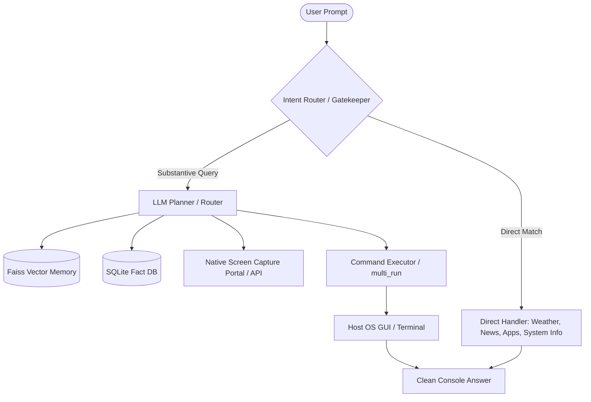

<div align="center">

# 🌌 XYRAN AI (v1.0)
### *Your Intelligent Personal AI Agent for Linux, macOS & Windows*

[](LICENSE)
[](https://www.python.org/)
[](https://kernel.org/)
[](https://apple.com/)
[](https://windows.com/)
[](https://github.com/shivam238/Xyran-Ai)

---

**Xyran** is a powerful, locally integrated personal AI agent engineered for cross-platform compatibility across Linux, macOS, and Windows systems. It seamlessly bridges advanced Large Language Models (LLMs) with your local shell, combining deep system automation, real-time vision, and permanent vector search memory under a beautifully polished console interface.

[**Get Started**](SETUP.md) • [**Core Features**](#-key-features) • [**Architecture**](#-architecture) • [**License**](LICENSE)

</div>

---

## 🚀 Key Features

* **🧠 Hybrid Dual Memory System**:
  * **Neural Vector Store**: Uses standard **FAISS** index with `all-MiniLM-L6-v2` Sentence Transformer embeddings to memorize past conversations and semantic user preference queries.
  * **Relational Database**: Persistent SQLite backend for storing explicit structural facts, settings, and memory logs.
* **👁️ Real-Time Vision Capability**:
  * Seamlessly takes GNOME/Wayland screenshots natively via the secure Freedesktop portal and passes visual contexts to a Vision LLM (`llama-4-scout-17b`) to "see" your work, troubleshoot errors, or perform GUI automation.
* **⚡ Smart Intent Routing & Gatekeeper**:
  * Direct parser bypasses LLM latency for offline commands (weather, system information, news, browser launcher, jokes).
  * Auto-selects between **Gemini** (for visual/complex reasoning) and **Groq** (for super-fast interactive answers).
* **🖥️ Interactive Terminal Automation (Multi-Step)**:
  * Can open browser instances (Brave/Chrome/Firefox), execute Google searches, open YouTube tabs, capture screenshots, launch folders via Nautilus, edit files, and automate multi-step system actions.
* **✨ Premium Terminal UX**:
  * Features a custom thread-based **`ThinkingSpinner`** that runs interactive loading animations (`[Xyran] Thinking... ⠋`) in the background and clears itself in-place once the API response lands.
  * Keeps the chat clean by suppressing backend system reasoning thoughts during direct chitchats.

---

## 📐 Architecture

Xyran relies on a modular, gated gateway system that processes user intent and executes actions securely.



---

## 🎨 Premium User Experience

Xyran is designed to feel alive. Its interface handles all heavy API requests asynchronously, showing a clean, moving spinner before replacing it instantly with a well-formatted Hinglish response.

```text
[darkeeidea] aaj weather batao
[Xyran] Thinking... ⠸ 

[Xyran] 🌦️ Aaj Delhi ka mausam suhana hai! Temp 32°C hai clear sky ke sath.
```

---

## 💻 Sample Commands

| Category | Example Command | What Xyran Does |
|---|---|---|
| **Memory** | `remember main ek AI engineer hoon` | Automatically index & store this preference in local vector memory |
| **System Info** | `laptop battery status` | Execute `upower` internally and summarize current battery percentage |
| **Vision** | `screen dekh ke batao ye error kya hai` | Capture desktop screens natively and analyze the visible terminal/code |
| **Browsing** | `chrome khol ke google search python tutorial` | Launch Google Chrome and navigate directly to query search |
| **Weather** | `Delhi ka mausam kaisa hai` | Internal fetch of real-time `wttr.in` details |
| **Multi-Step** | `text editor kholo, 'hello' likho aur screenshot lo` | Generate a 3-step sequence running shell write, opening GUI app, and shooting PNG |

---

## ⚙️ Quick Setup

Make sure Python and Fedora libraries are ready, then:

```bash
# Clone the repository
git clone https://github.com/shivam238/Xyran-Ai.git
cd Xyran-Ai

# Install system libraries (Fedora/Ubuntu/Arch)
# For Fedora: sudo dnf install -y python3-dbus python3-gobject xdotool
# For Ubuntu: sudo apt install -y python3-dbus python3-gi xdotool
# For Arch:    sudo pacman -S python-dbus python-gobject xdotool

# Initialize & configure variables
cp .env.example .env
nano .env

# Run Xyran
python xyran.py
```

*For an advanced and detailed guide, please refer to the [**SETUP.md**](SETUP.md) file.*

---

## 📄 License
Distributed under the **MIT License**. For details, see the [LICENSE](LICENSE) file.

<div align="center">
  
---
  
*Developed with ❤️ for the Linux Developer community by [shivam238](https://github.com/shivam238).*
  
</div>
